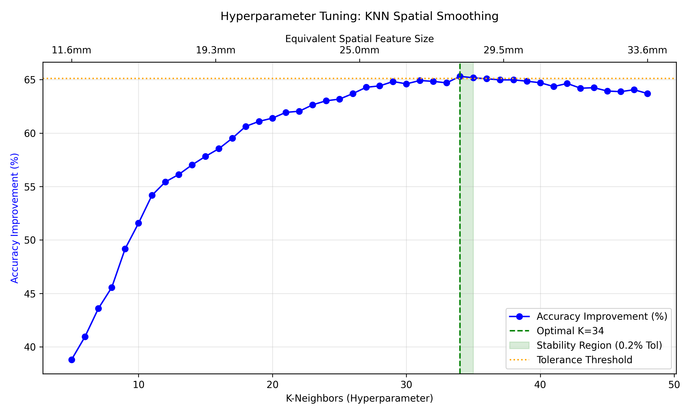
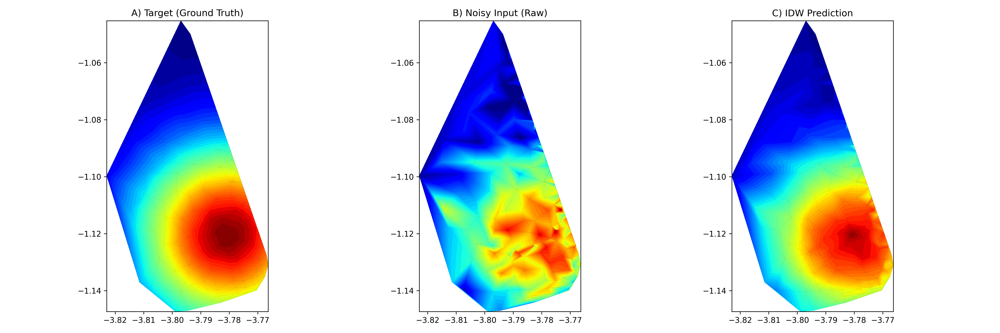
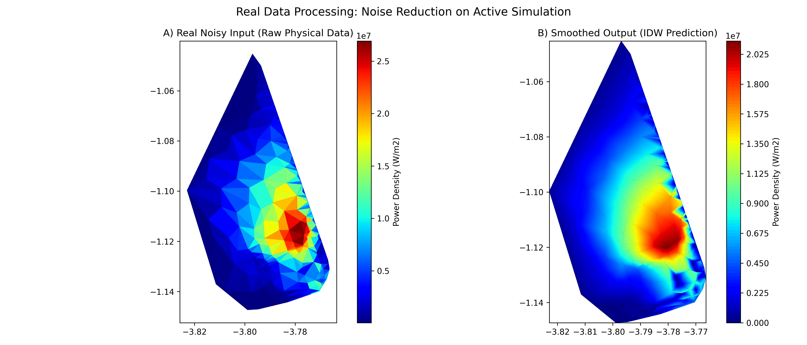

# 3D Mesh Spatial Smoothing and Data Reconstruction Pipeline

This repository contains a modular Python analytical pipeline designed to process, denoise, and reconstruct spatial data mapped onto highly asymmetrical 3D meshes. Originally developed to handle Monte Carlo tracking simulations (ASCOT) for JT-60SA FILD detectors, the architecture implements a dynamically optimized Inverse Distance Weighting (IDW) algorithm. 

The primary objective of this tool is to filter statistical noise from raw data arrays while strictly guaranteeing 100% conservation of the underlying integral values (total energy/load).

## Installation and Dependencies

The environment requires Python 3 and the following standard libraries for scientific computing and unit testing:

* `numpy`
* `scipy`
* `matplotlib`
* `pytest` (for unit testing and pipeline validation)

**Note:** Access to the `a5py` module is required for parsing the native HDF5 hierarchical data structures output by ASCOT.

## Usage Instructions

The core data pipeline is encapsulated within the `main.py` script. To execute the reconstruction algorithm on a raw dataset, place the target `.h5` file in the root directory and pass it via command-line arguments:

```bash
python main.py -i your_simulation_file.h5
```

### Unit Testing
To validate algorithmic integrity, mathematical stability, and strict energy conservation before processing real data assets, execute the test suite:

```bash
python -m pytest test_reconstruction.py -v
```

## Pipeline Architecture

The algorithmic workflow is divided into four sequential stages:

1. **Geometric Parsing:** Extraction of the 3D wall topology, computing polygonal areas and geometric centroids for the unstructured mesh elements.
2. **Synthetic Target Generation (Ground Truth):** Dynamic injection of a Gaussian distribution anchored to the empirical topological hotspot of the raw dataset. This establishes a robust evaluation environment regardless of mesh asymmetry or varying element density.
3. **Hyperparameter Optimization (K-d Tree):** Execution of a systematic parameter sweep using `scipy.spatial.cKDTree`. This identifies the optimal smoothing radius (K-neighbors) that maximizes noise reduction while operating within mathematical stability bounds.
4. **IDW Reconstruction:** Application of the Inverse Distance Weighting spatial filter to the raw physical data. The process concludes with a strict normalization tensor operation to ensure zero loss of the initial physical load.

## Data Visualizations and Benchmarks

Upon successful extraction and optimal hyperparameter tuning, the algorithm effectively isolates the true underlying distribution from the Monte Carlo statistical noise.

### 1. Hyperparameter Optimization
Systematic search for the optimal spatial smoothing factor, evaluating noise reduction efficiency and identifying the mathematical stability region.



### 2. Synthetic 2D Evaluation
Spatial comparison between the ideal target distribution (Ground Truth), the noisy synthetic input (Raw), and the reconstructed array (IDW Prediction) operating over the highest density mesh area.



### 3. Real Physical Data Processing
Application of the optimized smoothing matrix to the active simulation's raw arrays, effectively isolating the thermal distribution while strictly conserving total integral energy.


